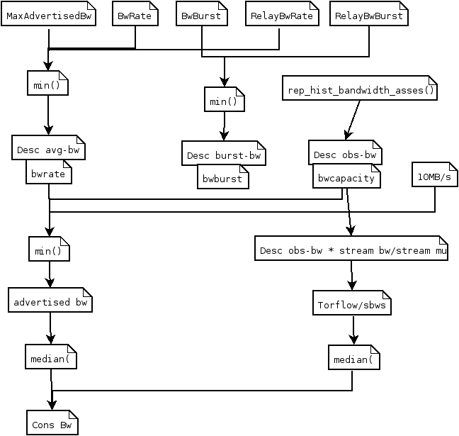

.. _bandwidth_tor:

Bandwidth values in Tor (Aug 2018)
===================================

.. _bandwidth_tor_conf:

Bandwidth values in relays' configuration
------------------------------------------

``/etc/tor/torrc``

* BandwidthRate
  A token bucket limits the average incoming/outgoing bandwidth (default 1GB)
* BandwidthBurst
  Limit the maximum token bucket size (also known as the burst) in each direction (default: 1GB)
* MaxAdvertisedBandwidth
  will not advertise more than this amount of bandwidth for our BandwidthRate
  Server operators who want to reduce the number of clients who ask
  to build circuits through them (since this is proportional to advertised bandwidth rate) can thus reduce the CPU demands on their server without impacting
  network performance.
* RelayBandwidthRate
* RelayBandwidthBurst
* PerConnBWRate
* PerConnBWBurst

[TOR1]_

.. _bandwidth_tor_desc:

Bandwidth values in relays' descriptor
---------------------------------------

* ``average bandwidth`` (not any measurements)
  bw that the relay is willing to sustain over long periods
* ``burst bandwidth``
  bw that the relay is willing to sustain in very short intervals
* ``observed bandwidth``
  min(max bandwidth sustained output over any 10secs in the past day,
  another sustained input)

.. code-block:: none

  "bandwidth" bandwidth-avg bandwidth-burst bandwidth-observed NL

[DIRSPEC427]_

From tor code:

.. code-block:: none

   bandwidth-avg = bandwidtrate = get_effective_bwrate()
                 = min(RelayBandwidthRate, BandwidthRate, MaxAdvertisedBandwidth)
   bandwidth-burst = bandwidthburst = get_effective_bwburst()
                   = min(RelayBandwidthBust, BandwidthBurst)
   bandwidth-observed = bandwidthcapacity = rep_hist_bandwidth_assess()

``advertised bandwidth`` = min(average bandwidth, burst bandwidth, observed bandwidth)

Bandwidth values in dirauths' consensus documents
--------------------------------------------------

.. code-block:: none

  "w" SP "Bandwidth=" INT [SP "Measured=" INT] [SP "Unmeasured=1"] NL

[DIRSPEC2337]_

Bandwidth = min(observed bandwidth, descriptor bandwidth rate limit [?], 10MB/s) 
KB/s

Measured = consensus bandwidth * ratio(avg stream, ``network avg`` [?])

.. code-block:: none

  If 3 or more authorities provide a Measured= keyword for
  a router, the authorities produce a consensus containing a "w"
  Bandwidth= keyword equal to the median of the Measured= votes.

Bandwidth values origin
------------------------------

