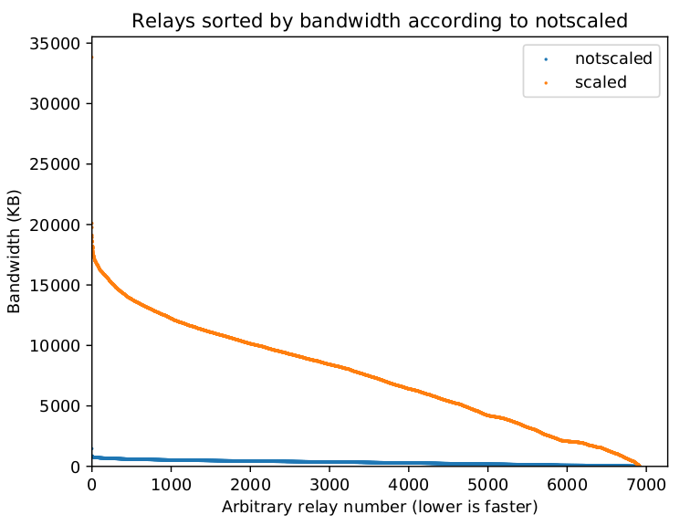

Consensus weight distributions goal
=======================================

Raw bandwidth measurements distribution
------------------------------------------

linear

.. image:: images/43710932-ac1eeea8-9960-11e8-9e7e-21fddff2f7a3.png

Torflow
---------

exponential

.. image:: images/20180901_164014.png

sbws current
--------------

linear

sbws as in bandwidth-file-spec.txt

.. math::

  7500 =& \frac{\sum_{i=1}^{n}bw_{i_measured}}{n_{measured}} \\
  bwn_i =& bw_i\frac{7500}{\frac{n_{measured}}{n_{unmeasured}}}

distribution goal
-------------------

TBD
