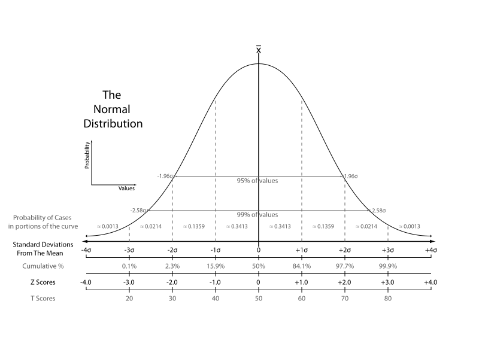

.. _statistics:

Statistics background 
=======================

for understanding bandwidth scanners/generators

Standard deviation
-------------------

The formula for the sample standard deviation is

.. math::

    s={\sqrt {\frac {\sum _{i=1}^{N}(x_{i}-{\overline {x}})^{2}}{N-1}}}

where :math:`{x_{1},x_{2},\ldots ,x_{N}}`  are the observed values of the 
sample items, :math:`{\overline {x}}` is the mean value of these observations, 
and N is the number of observations in the sample. 

.. image:: images/Comparison_standard_deviations.svg

[stdev]_

Standard score
----------------

If the population mean and population standard deviation are known, 
the standard score of a raw score x[1] is calculated as

.. math::

    z={x-\mu \over \sigma }

where:

μ is the mean of the population.
σ is the standard deviation of the population.

[stdscore]_
